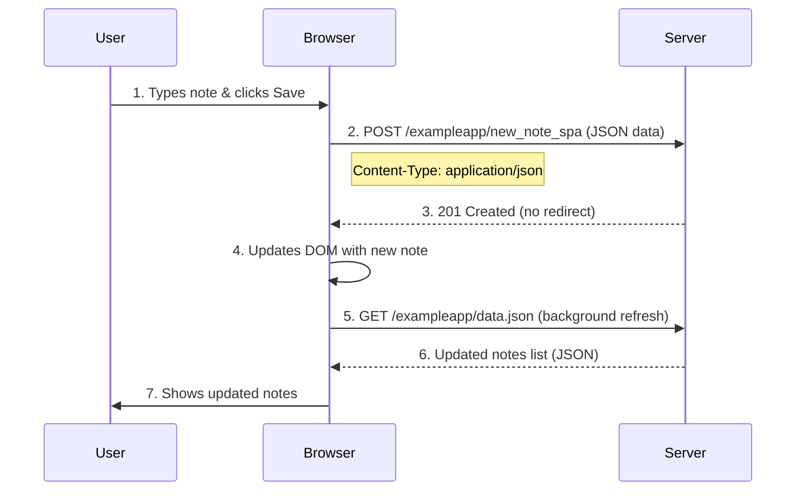

```mermaid
sequenceDiagram
    participant User
    participant Browser
    participant Server

    User->>Browser: 1. Types note & clicks Save
    Browser->>Server: 2. POST /exampleapp/new_note_spa (JSON data)
    Note right of Browser: Content-Type: application/json
    Server-->>Browser: 3. 201 Created (no redirect)
    Browser->>Browser: 4. Updates DOM with new note
    Browser->>Server: 5. GET /exampleapp/data.json (background refresh)
    Server-->>Browser: 6. Updated notes list (JSON)
    Browser->>User: 7. Shows updated notes
```
