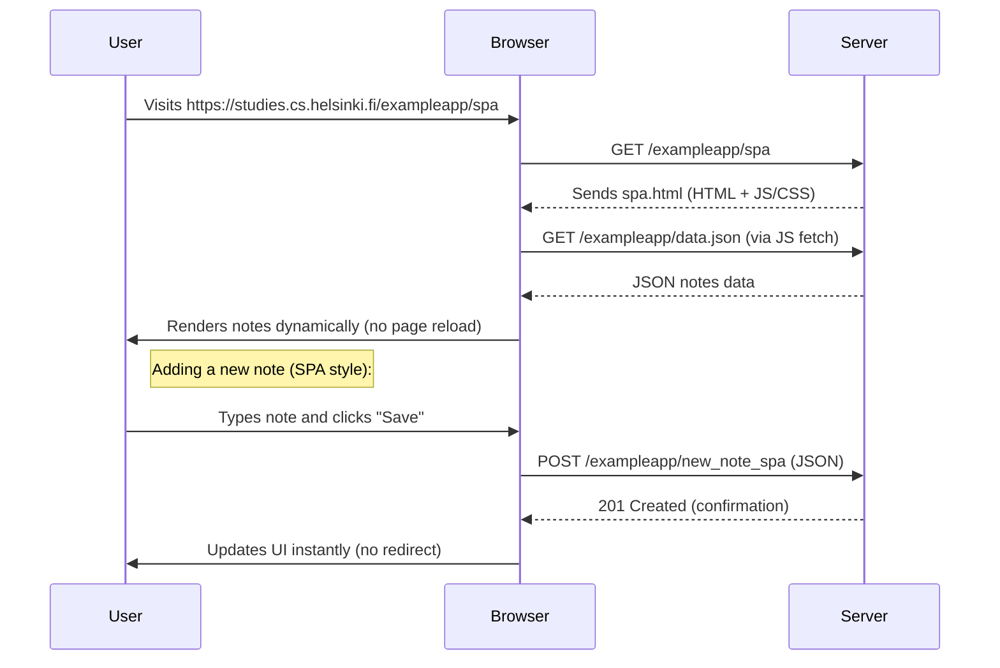

```mermaid
sequenceDiagram
    participant User
    participant Browser
    participant Server

    User->>Browser: Visits https://studies.cs.helsinki.fi/exampleapp/spa
    Browser->>Server: GET /exampleapp/spa
    Server-->>Browser: Sends spa.html (HTML + JS/CSS)
    Browser->>Server: GET /exampleapp/data.json (via JS fetch)
    Server-->>Browser: JSON notes data
    Browser->>User: Renders notes dynamically (no page reload)
    
    Note right of User: Adding a new note (SPA style):
    User->>Browser: Types note and clicks "Save"
    Browser->>Server: POST /exampleapp/new_note_spa (JSON)
    Server-->>Browser: 201 Created (confirmation)
    Browser->>User: Updates UI instantly (no redirect)
```
